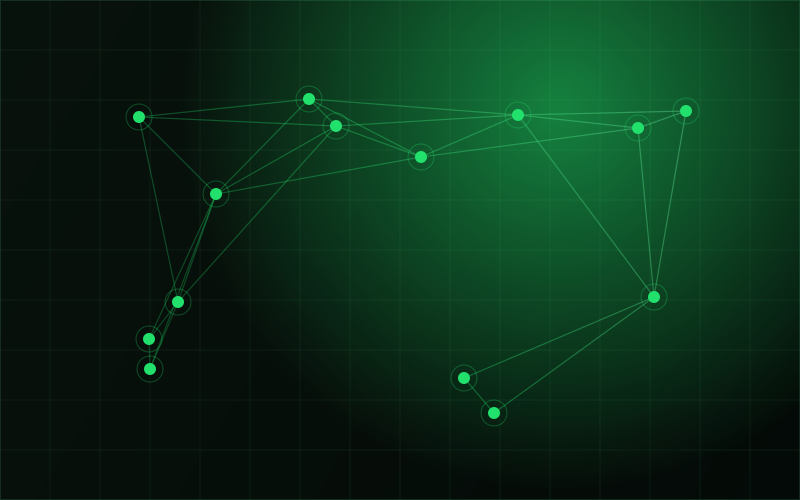

# سایت ایجنت‌یار

سایت استاتیک فارسی (RTL). همه‌ی فایل‌ها در یک سطح‌اند تا آپلود از طریق مرورگر گیت‌هاب ساختار را خراب نکند.

## آپلود

وارد پوشه شو، `Ctrl+A`، همه را بکش داخل `Add file → Upload files` در ریپو، بعد `Commit changes`.
هیچ زیرپوشه‌ای وجود ندارد، پس صاف شدن ساختار دیگر مشکلی ایجاد نمی‌کند.

## صفحه‌ها

| فایل | چیست |
|---|---|
| `index.html` | صفحه‌ی اصلی — برای صاحب سالن و آرایشگاه |
| `business.html` | ایجنت‌یار بیزنس — مجموعه‌های چندشعبه‌ای (بدون دمو، با پل به صفحه‌ی اصلی) |
| `blog.html` | لیست مقالات با جست‌وجو و فیلتر |
| `article.html` | قالب مقاله (برای مقاله‌ی بعدی کپی بگیر) |
| `404.html` | صفحه‌ی خطا |

## ترتیب بخش‌های صفحه‌ی اصلی (یوزرجرنی)

۱. **هیرو** — وعده‌ی مشخص + دکمه‌ی واتساپ + موکاپ مکالمه
۲. **نوار اصناف** — متحرک
۳. **مشکل** — «این وضعیت برایتان آشناست؟»
۴. **قبل و بعد** — «یک هفته بعد چه فرقی کرده؟»، ردیف‌های جفت‌شده
۵. **امنیت** — «پیج شما، دست خودتان می‌ماند» (عمداً بالا آورده شده)
۶. **چطور کار می‌کند** — سه قدم
۷. **دستیارها** — شش دستیار، فهرست فشرده
۸. **ربات یا دستیار هوشمند؟** — جدول مقایسه
۹. **نظرات مشتریان** — ⚠️ کامنت‌شده، پایین را بخوانید
۱۰. **قیمت** — سه پلن + پنل «چرا شش‌ماهه؟»
۱۱. **سوالات متداول**
۱۲. **اقدام نهایی + راه‌های تماس + فوتر**

منطق: مشکل ← نتیجه ← رفع ترس ← اجرا ← تمایز ← قیمت ← اقدام.

نسبت به نسخه‌ی قبل، حجم متن صفحه‌ی اصلی حدود ۴۰٪ کم شده است.

## لحن

کل متن‌ها رسمی و با «شما» نوشته شده‌اند. کلمه‌ی «ایجنت» فقط داخل نام «ایجنت‌یار»
به کار رفته؛ در باقی موارد «دستیار» یا «دستیار هوشمند» جایگزین شده است.

## بخش نظرات مشتری‌ها

در `index.html` بین بخش امنیت و بخش قیمت، یک بلاک کامنت‌شده هست با عنوان
«۸. نظرات مشتری‌ها». قالبش کامل آماده است ولی **عمداً خاموش گذاشته شده** چون
نظر ساختگی ننوشتم. هر وقت دو سه مشتری واقعی داشتی:

۱. متن‌ها، اسم‌ها و آیدی پیج‌ها را با نظر واقعی خودشان عوض کن
۲. خط `<!--` بالای بلاک و خط `-->` پایینش را پاک کن

## پنل «چرا شش‌ماهه؟»

بخش جداگانه‌ی «چرا شش‌ماهه بهتر است» حذف شده و به خود کارت پلن منتقل شده:

- روی دسکتاپ، کافی است موس روی کارت شش‌ماهه برود تا پنل از پایین بالا بیاید
- روی موبایل، دکمه‌ی «چرا شش‌ماهه؟» زیر دکمه‌ی خرید همین کار را می‌کند
- با `Esc` یا کلیک بیرون کارت بسته می‌شود

متنش در `index.html` داخل `<div class="plan__why">` است.

## قیمت‌ها

سه پلن در بخش `#pricing` صفحه‌ی اصلی، دقیقاً مطابق پست اینستاگرام:

| پلن | قیمت قبل | قیمت | توضیح |
|---|---|---|---|
| ۱ ماهه | ۱۵ میلیون | ۱۰ میلیون | دوره‌ی تست |
| ۶ ماهه | ۹۰ میلیون | ۷۸ میلیون | ۱۲ میلیون تخفیف — پیشنهاد ویژه |
| ۱۲ ماهه | ۱۸۰ میلیون | ۱۵۰ میلیون | ۳۰ میلیون تخفیف |

برای تغییر، در `index.html` دنبال `class="plan` بگرد.

## عناصر داینامیک

- نوار پیشرفت اسکرول در بالای صفحه
- نوار CTA چسبان در موبایل (بعد از هیرو ظاهر می‌شود، نزدیک فوتر محو می‌شود)
- نوار متحرک کسب‌وکارها (با هاور متوقف می‌شود)
- شمارنده‌ی اعداد آمار
- ظاهر شدن تدریجی بخش‌ها هنگام اسکرول
- هایلایت خودکار بخش فعال در منو
- انیمیشن مکالمه‌ی موکاپ گوشی
- آکاردئون سوالات متداول، جست‌وجو و فیلتر زنده‌ی بلاگ

همه با `prefers-reduced-motion` خاموش می‌شوند و بدون جاوااسکریپت هم کل محتوا دیده می‌شود.

## لوگو

لوگوی رسمی به‌صورت PNG شفاف در سایت نشسته است:

- `logo.png` — لاکاپ ایجنت‌یار (هدر، فوتر و منوی همه‌ی صفحات)
- `logo-business.png` — لاکاپ ایجنت‌یار بیزنس (هدر و منوی `business.html`)
- `mark.png` — فقط علامت مثلث، برای ساخت آیکون‌ها

فاوآیکون، آیکون موبایل و تصویر اشتراک‌گذاری (`favicon.png`، `apple-touch-icon.png`،
`icon-192.png`، `icon-512.png`، `og-image.png`) همه از روی همین علامت ساخته شده‌اند.

ارتفاع نمایش لوگو در `style.css` بخش «لوگوی رسمی» تنظیم می‌شود.

## فونت

فونت روی **یکان بخ (Yekan Bakh)** تنظیم شده و از CDN فارسی لود می‌شود:

```html
<link href="https://v1.fontapi.ir/css/YekanBakh" rel="stylesheet">
```

اگر فونت درست نیامد یا می‌خواهی مستقل از CDN باشد (سریع‌تر هم هست):

1. فایل‌های `woff2` یکان بخ را کنار بقیه فایل‌ها بگذار با این اسم‌ها:
   `YekanBakh-Light.woff2`، `YekanBakh-Regular.woff2`، `YekanBakh-Medium.woff2`،
   `YekanBakh-Bold.woff2`، `YekanBakh-Heavy.woff2`، `YekanBakh-Fat.woff2`
2. خط `v1.fontapi.ir` را از `<head>` همه‌ی صفحات پاک کن
3. در بالای `style.css` بلاک `@font-face` را از کامنت خارج کن

## اطلاعات تماس

| مورد | مقدار |
|---|---|
| واتساپ | `989350886064` (در `main.js` خط `CONFIG.whatsapp`) |
| اینستاگرام | `@Agentyar_com` |
| ایمیل | `Jafariyounes8@gmail.com` |
| دامنه | `agentyar.com` |

دکمه‌های اصلی سایت مستقیم به واتساپ با یک پیام آماده می‌روند. برای عوض کردن متن آن پیام،
در HTMLها بخش `?text=` لینک‌های `wa.me` را تغییر بده.

## تصاویر بلاگ

شش کاور `cover-1.jpg` تا `cover-6.jpg` از نو ساخته شده‌اند: هر کدام پالت رنگی
جداگانه دارد (نارنجی خاکی، بنفش، فیروزه‌ای، سرمه‌ای، بنفش روشن، مرجانی)، عنوان
مقاله روی خود تصویر نوشته شده و لوگوی ایجنت‌یار در گوشه‌ی پایین نشسته است.

⚠️ این‌ها **عکس واقعی نیستند**، گرافیک طراحی‌شده‌اند. دانلود عکس واقعی از این محیط
ممکن نبود. هر وقت عکس واقعی سالن یا کار خودتان را فرستادید، همین قالب (عنوان روی
تصویر + لوگو در گوشه) روی عکس‌های واقعی اعمال می‌شود.

## اعداد آمار

اعداد `۱۰٬۰۰۰+`، `۲۰۰+`، `۹۸٪` (و در صفحه‌ی بیزنس `۵۰+`، `۹۵٪`، `۳۰٪+`) هنوز از موکاپ آمده‌اند
و واقعی نیستند. هر وقت عدد واقعی داشتی، در `index.html` و `business.html` بخش `<div class="stats">` را عوض کن.

## رنگ‌ها

همه در `:root` بالای `style.css`:

```css
--brand:        #21e06b;
--brand-bright: #4dff92;
--brand-mid:    #16b757;
--brand-deep:   #0c7a3a;
--bg-base:      #050806;
```

## اضافه کردن مقاله

از `article.html` کپی بگیر، محتوا را عوض کن، بعد در `blog.html` یک کارت اضافه کن:

```html
<a class="post" href="article-2.html" data-category="booking" data-tags="کلمات کلیدی">
  <div class="post__media">
    
    <span class="post__badge">راهنما</span>
  </div>
  <div class="post__body">
    <h3>عنوان</h3>
    <div class="post__meta"><span>تاریخ</span><span>۵ دقیقه مطالعه</span></div>
  </div>
</a>
```

`data-category` یکی از این‌ها: `booking` · `growth` · `ai` · `case`

## دامنه

فایل `CNAME` در این بسته نیست تا سایت روی آدرس github.io کار کند.
هر وقت DNS آماده شد، در `Settings → Pages → Custom domain` بنویس `agentyar.com` و Save بزن.
